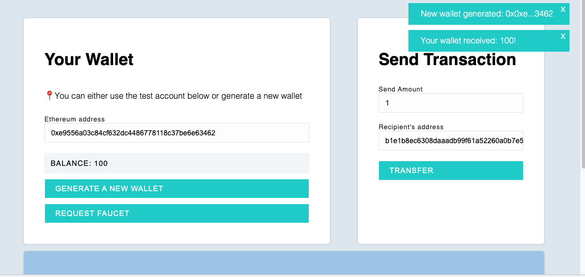

## ECDSA Node (Ethereum Bootcamp Week1 Project)

### Project Description 
In this project, I built an ECDSA node using my knowledge of how Public Key Cryptography works, Hash functions, and Consensus mechanism.

The project consists of a simple React front-end that communicates with a single server. Users can generate a new wallet, consisting of their own public-private key pair, which is securely stored only on their local machine. When a user signs a transaction, a new digital signature is generated and sent to the server. Only the user with the appropriate private key can create a signature that allows them to move funds from one account to another.

The server verifies that the digital signature it receives is validly signed by the owner (sender) who owns the private key corresponding to the address that is sending the funds. Once this validation passes, the balance is updated.

### APP UI 

### How it works

**Wallet**
- The app asks you to enter an 42 bytes ethereum address
- You can either generate a new wallet, in which case the private key will be saved in your local storage or utilize a test account displayed at the bottom of the page
- If you generated a new wallet, you can request a faucet to fill up the balance up to 100

**Transfer**
- A transaction is signed using user's private key, and the signature and the recovery bit is sent to the server 
- Server verifies 2 things:
  - Public key is valid and matches the sender's address
  - Signature is signed by the sender
- If there is enough balance in the senders' account, and all the validation passes, balance is updated 

### Key libraries used 
- [Ethereum Cryptography library](https://github.com/ethereum/js-ethereum-cryptography) 
  - To generate a random private key and its matching public key
  - Recover public key 
  - Sign & verify transactions 

---
### Instructions 

This project is an example of using a client and server to facilitate transfers between different addresses. Since there is just a single server on the back-end handling transfers, this is clearly very centralized. We won't worry about distributed consensus for this project.

However, something that we would like to incoporate is Public Key Cryptography. By using Elliptic Curve Digital Signatures we can make it so the server only allows transfers that have been signed for by the person who owns the associated address.

### Video instructions
For an overview of this project as well as getting started instructions, check out the following video:

https://www.loom.com/share/0d3c74890b8e44a5918c4cacb3f646c4
 
### Client

The client folder contains a [react app](https://reactjs.org/) using [vite](https://vitejs.dev/). To get started, follow these steps:

1. Open up a terminal in the `/client` folder
2. Run `npm install` to install all the depedencies
3. Run `npm run dev` to start the application 
4. Now you should be able to visit the app at http://127.0.0.1:5173/

### Server

The server folder contains a node.js server using [express](https://expressjs.com/). To run the server, follow these steps:

1. Open a terminal within the `/server` folder 
2. Run `npm install` to install all the depedencies 
3. Run `node index` to start the server 

The application should connect to the default server port (3042) automatically! 

_Hint_ - Use [nodemon](https://www.npmjs.com/package/nodemon) instead of `node` to automatically restart the server on any changes.

